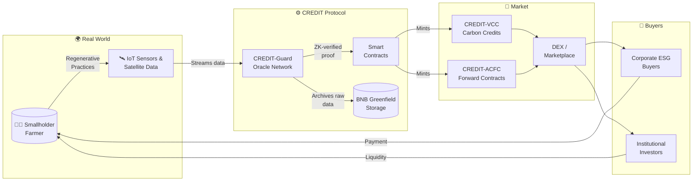
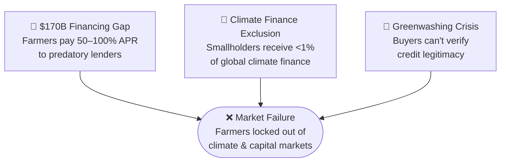
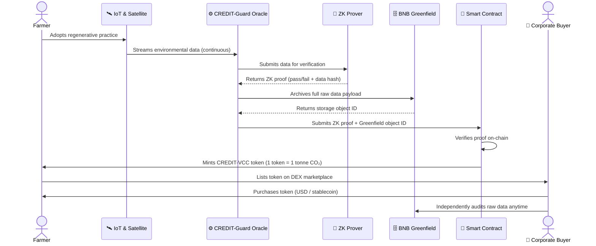
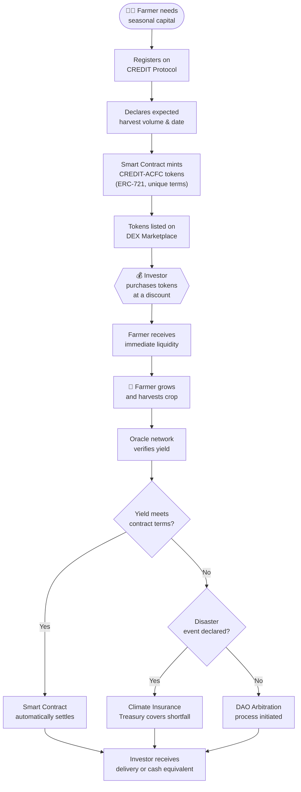
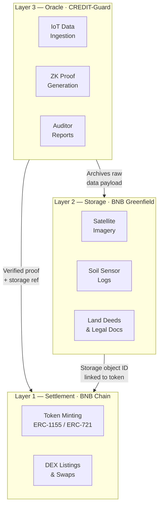
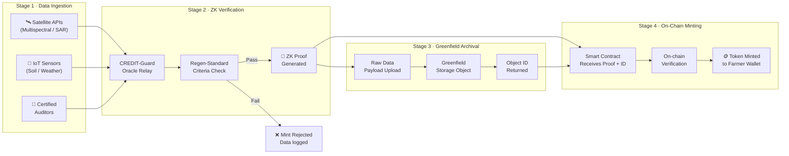
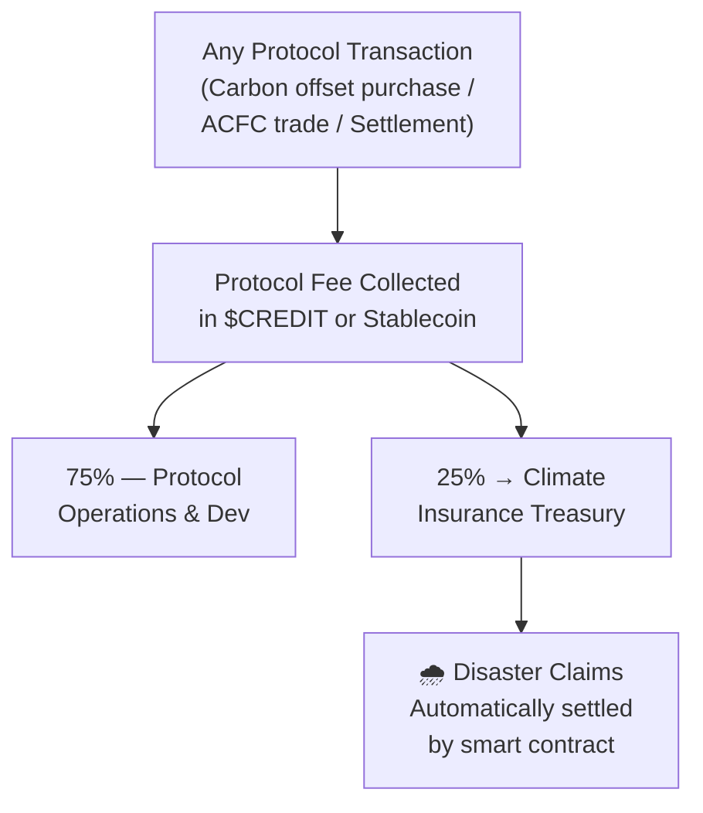
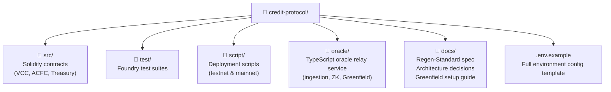

# C.R.E.D.I.T. — Carbon & Regenerative Ecological Derivatives Investment Token

*Financing the future of the planet — one acre at a time.*

---

## Table of Contents

- [Overview](#overview)
- [The Problem](#the-problem)
- [The CREDIT Solution](#the-credit-solution)
- [Technical Architecture](#technical-architecture)
- [Tokenomics](#tokenomics)
- [Getting Started](#getting-started)
- [License](#license)

---

## Overview

CREDIT is a decentralized **Regenerative Finance (ReFi)** protocol built on **BNB Chain**. Its core mission is straightforward: bridge the enormous gap between smallholder farmers in emerging markets — particularly across India and Southeast Asia — and the pools of global institutional capital that currently have no practical way to reach them.

The protocol achieves this by transforming two categories of real-world assets into liquid, on-chain financial instruments. The first is **Verified Carbon Credits (VCC)**, which represent measurable, satellite-confirmed reductions in atmospheric CO₂ generated by regenerative farming practices. The second is **Agricultural Commodity Forward Contracts (ACFC)**, which represent a legally enforceable claim on a defined portion of a farmer's future harvest.

What distinguishes CREDIT from conventional carbon markets or agricultural finance platforms is its end-to-end approach to data integrity. By anchoring every token to immutable records stored on **BNB Greenfield** and relying on **dMRV (Digital Monitoring, Reporting & Verification)** oracles to validate real-world events without human interference, CREDIT removes the single greatest obstacle to scaling climate and agricultural finance: the trust deficit between buyers, sellers, and auditors.

### Ecosystem at a Glance

---

## The Problem

The global agricultural and climate finance systems are broken in three interconnected ways. Understanding all three is essential to understanding why CREDIT is designed the way it is.

### The $170 Billion Financing Gap

Smallholder farmers — those working plots of land typically under two hectares — represent a majority of the world's agricultural workforce, yet they are almost entirely excluded from formal financial systems. Banks and microfinance institutions either lack the infrastructure to serve rural communities at scale, or they perceive small farms as too risky to lend to without collateral.

The consequence is that farmers who need seasonal credit to purchase seeds, fertiliser, and equipment are forced to borrow from local moneylenders who routinely charge between 50% and 100% annual interest. These rates are not anomalies — they are the norm across large parts of South Asia and Southeast Asia. A farmer who borrows to plant a crop in April may find that by the time they harvest in October, the majority of their earnings are already owed in interest. This cycle traps generations of farming families in perpetual debt, preventing them from investing in better land practices, equipment, or their children's futures.

### Climate Finance Exclusion

The agricultural sector is simultaneously one of the largest contributors to global greenhouse gas emissions and one of the most powerful potential carbon sinks on the planet. Practices like zero-tillage farming, cover cropping, rotational grazing, and agroforestry can lock significant quantities of carbon dioxide back into the soil over time. The science is clear: well-managed agricultural land can meaningfully contribute to global climate targets.

And yet smallholder farmers — the very people with both the land and the incentive to adopt these practices — receive less than **1% of global climate finance**. The reasons are structural. Climate funds are designed to flow toward large, centralised projects with easily auditable outcomes. A single farmer in rural Maharashtra sequestering a few tonnes of CO₂ per year cannot individually access the Voluntary Carbon Market, because the transaction costs of verification and certification are prohibitively high relative to the value of the credits they would generate.

The result is a market failure at global scale. The communities most capable of contributing to climate solutions — and most vulnerable to climate consequences — are consistently the ones left out.

### The Greenwashing Crisis and the Trust Deficit

On the demand side, corporate buyers face a different but equally serious problem. Voluntary carbon markets have been plagued by credibility scandals. Investigative reports have repeatedly found that a significant proportion of credits sold on major registries do not represent the carbon reductions they claim. Some projects were found to have never existed. Others relied on baseline assumptions that dramatically overstated their real-world impact.

The fallout has been severe. Major corporations that purchased offsets in good faith have faced accusations of greenwashing, and institutional trust in carbon markets has collapsed. Many ESG-focused buyers have paused their offset purchases entirely — not because they don't want to act on climate, but because they cannot confidently verify that the credits they buy actually do what they say.

This creates a paradox: there is enormous latent demand for high-quality carbon offsets, and there is an enormous supply of real ecological impact happening in agricultural communities worldwide — but the two sides cannot connect, because the verification infrastructure to make that connection credible simply does not exist at scale.

**CREDIT is built to close that gap.**

---

## The CREDIT Solution

CREDIT addresses each layer of the problem with a purpose-built financial and technical instrument.

### Verified Carbon Credits — CREDIT-VCC

When a farmer enrolled in the CREDIT protocol adopts a qualifying regenerative agricultural practice — such as switching from conventional tillage to zero-tillage, planting cover crops between growing seasons, introducing agroforestry buffer strips, or managing livestock rotation to promote grassland recovery — the protocol begins monitoring and recording the ecological outcomes of those changes.

This monitoring is not self-reported. Satellite imagery, processed through the CREDIT-Guard oracle network, tracks changes in soil carbon proxies, vegetation density, and land-use patterns over time. IoT sensors deployed at partner farms contribute ground-level soil moisture and organic matter readings. All of this data is cross-referenced against the protocol's **Regen-Standard** — a scientifically grounded framework for attributing tonnes of CO₂ sequestration to specific farm-level interventions.

When the data confirms that a genuine, measurable carbon outcome has been achieved, the smart contract mints a corresponding **CREDIT-VCC** token directly to the farmer's wallet. Each token represents exactly one metric ton of verified CO₂ sequestration. The underlying data payload — satellite images, sensor logs, verification proofs, and the farmer's land registration records — is permanently archived on **BNB Greenfield**, where it cannot be altered, deleted, or disputed after the fact.

Corporate buyers purchasing CREDIT-VCC tokens receive not just an offset credit, but a complete, independently accessible audit trail that their compliance and ESG teams can verify without relying on CREDIT as an intermediary. The era of taking a registry's word for it is over.

#### VCC Lifecycle

### Agricultural Commodity Forward Contracts — CREDIT-ACFC

The CREDIT-ACFC instrument is designed to solve the working capital problem directly. A forward contract, in traditional finance, is an agreement to buy or sell an asset at a specified price on a future date. CREDIT brings this instrument on-chain and makes it accessible to individual smallholder farmers for the first time.

Here is how it works in practice. A farmer in Tamil Nadu expects to harvest 10 tonnes of rice in November. In April, they need capital to buy seeds and pay for land preparation, but they have no collateral and no access to a bank. Through the CREDIT protocol, they can mint CREDIT-ACFC tokens that represent a defined percentage of their anticipated November harvest — say, 4 tonnes of rice, valued at the current commodity spot price with a discount applied for time and delivery risk.

An investor purchases those tokens today at the discounted price, providing the farmer with immediate liquidity. In November, when the harvest is complete and verified by the oracle network, the investor receives either a coordinated physical commodity delivery (through partner logistics networks) or a cash-equivalent settlement at the prevailing market price. The farmer has already been paid and can focus on growing.

The entire agreement — its terms, the farmer's yield verification, the settlement conditions, and the payout mechanism — is governed by a smart contract. There are no loan officers, no paperwork, and no intermediaries extracting margins at every step.

#### ACFC Lifecycle

---

## Technical Architecture

CREDIT is built on a three-layer stack, each layer selected for what it does best in service of the protocol's goals.

| Layer | Component | Function |
| :--- | :--- | :--- |
| **Settlement** | BNB Chain | Token minting (ERC-1155 & ERC-721), DEX listings, and atomic settlement |
| **Storage** | BNB Greenfield | Immutable archival of all dMRV data: satellite imagery, sensor logs, and legal documents |
| **Oracle** | CREDIT-Guard Network | Bridges real-world IoT, satellite, and auditor data to trigger on-chain events |

### Why BNB Chain?

BNB Chain offers the combination of EVM compatibility, low transaction fees, and high throughput that a protocol serving smallholder farmers requires. Carbon credit transactions and forward contract settlements need to be affordable enough that a farmer minting a $15 token is not paying $10 in gas fees. BNB Chain's fee structure makes this economics viable at the scale CREDIT is designed to operate.

**ERC-1155** is used for CREDIT-VCC tokens because it allows multiple token types — representing different agricultural projects, carbon vintages, or regional methodologies — to coexist under a single contract, significantly reducing deployment and operational overhead. **ERC-721** is used for CREDIT-ACFC forward contracts because each contract has unique terms (harvest date, commodity type, volume, delivery location, settlement conditions) that make it a distinct, non-fungible instrument that cannot be interchanged with any other.

### Why BNB Greenfield?

BNB Greenfield is a decentralised storage network purpose-built to pair with BNB Chain. It allows data to be stored immutably and durably off-chain while remaining cryptographically linked to on-chain records — so anyone can verify the connection between a token and its underlying data, without that data having to live expensively on the blockchain itself.

For CREDIT, this solves a critical architectural problem. The data underlying each carbon credit is substantial: high-resolution multispectral satellite imagery, multi-year IoT sensor logs, land deed scans, auditor reports. None of this can practically live on a public blockchain. But it must be permanently accessible and provably untampered-with if the credits are to carry any institutional credibility.

When a CREDIT-VCC token is minted, the corresponding Greenfield storage object is referenced directly in the token's on-chain metadata. Any buyer, auditor, regulator, or researcher can independently retrieve and interrogate the raw data at any point in time — years or decades after the original mint. The archive is not controlled by CREDIT as an organisation. It is maintained by the decentralised Greenfield storage network, meaning no single party can alter or delete it.

### The CREDIT-Guard Oracle Network

Oracles are the trusted bridges between the physical world and blockchain smart contracts. CREDIT-Guard is the protocol's custom oracle layer, responsible for collecting, validating, and relaying the real-world environmental data that determines whether tokens get minted and under what conditions ACFC contracts settle.

The oracle network draws from three primary sources. **Satellite APIs** — including commercial providers offering multispectral and synthetic aperture radar imagery — supply regional land-use and vegetation data on regular update cycles. **IoT sensor networks** deployed at partner farms contribute granular soil composition, moisture, and microclimate readings. **Third-party auditors**, certified under the Regen-Standard framework, provide periodic human review reports for complex, disputed, or high-value assessments where automated verification alone is insufficient.

Critically, CREDIT-Guard uses **Zero-Knowledge (ZK) proofs** at the verification stage. A ZK proof allows the oracle network to demonstrate that a data payload satisfies the required conditions — for example, that soil organic carbon content has increased beyond a verified threshold — without revealing the underlying raw data to the public blockchain. This simultaneously protects farmer privacy, prevents competitors from reverse-engineering proprietary farming strategies, and keeps sensitive land ownership information off a public ledger — all while allowing any party to independently confirm that the verification outcome is mathematically valid.

### The Verification-to-Minting Pipeline

The full lifecycle of a CREDIT token — from a real-world agricultural event to a tradeable on-chain asset — proceeds through four distinct stages.

**Stage 1 — Data Ingestion.** IoT devices and satellite APIs continuously stream environmental data to the CREDIT relay infrastructure. Every incoming data packet is timestamped and cryptographically signed by its source, creating an unbroken chain of provenance from the moment the raw reading is taken. No human curates or pre-filters this feed.

**Stage 2 — ZK Verification.** The oracle network processes the incoming data against the Regen-Standard criteria for the specific farming practice being assessed. A Zero-Knowledge proof is generated that encodes the result of this check — pass or fail — along with the cryptographic hash of the underlying data used to reach that conclusion. The proof is compact and inexpensive to verify on-chain, and it contains no information that could compromise farmer privacy or expose sensitive land data.

**Stage 3 — Greenfield Archival.** Before any token is minted, the complete raw data payload — everything from full-resolution satellite imagery tiles to soil sensor logs and scanned legal documents — is uploaded to BNB Greenfield. The resulting decentralised storage object ID is recorded and linked to the pending mint event, creating a permanent, auditable connection between the token and its evidentiary foundation.

**Stage 4 — Smart Contract Minting.** The smart contract receives the ZK proof, verifies its validity on-chain, confirms the Greenfield archive reference is correctly linked, and mints the appropriate token to the farmer's wallet. This entire process is automated, deterministic, and requires no approval or action from any CREDIT team member. The integrity of each token is a mathematical property of the system itself.

---

## Tokenomics

**$CREDIT** is the native utility token of the protocol. It is not a speculative instrument bolted on for fundraising purposes — it is the connective tissue that aligns the economic incentives of farmers, investors, and oracle operators toward the same long-term outcome.

### Token Flow Overview

### Protocol Fee Discounts

All transactions on the CREDIT marketplace — purchasing carbon offsets, trading forward contracts, settling ACFC positions — incur a small protocol fee that sustains the network's ongoing development and operational costs. Users who hold $CREDIT and choose to denominate their fee payments in the native token receive a **25% reduction** in their total fee obligation. This creates natural, recurring demand for $CREDIT entirely independent of speculative interest.

### Climate Insurance Treasury

A defined percentage of every protocol fee collected across all CREDIT transactions is automatically redirected — without any human discretion — into a community-governed **Climate Insurance Treasury**. This treasury serves as the protocol's systemic risk backstop.

Agricultural income is inherently exposed to catastrophic, unforeseeable events: flash floods, prolonged droughts, late-season frosts, or large-scale pest infestations. A farmer who has sold ACFC forward contracts and cannot deliver the promised harvest would, without any insurance, trigger a default event that harms investors and erodes market confidence across the platform. The Climate Insurance Treasury addresses this directly: when a qualifying disaster event is declared and verified by the oracle network, affected farmers receive automatic settlement from the treasury, protecting both the farmer and the investor simultaneously.

---

## Getting Started

### Prerequisites

To deploy, test, or build integrations on top of the CREDIT protocol, you will need three core tools set up in your development environment.

**Node.js v20 or higher** is required for the JavaScript and TypeScript tooling that manages deployment configuration, environment variable handling, BNB Greenfield SDK interactions, and the oracle relay service. Earlier versions of Node.js lack certain runtime features that the CREDIT toolchain depends on.

**The BNB Greenfield CLI** is the command-line interface for interacting with the Greenfield decentralised storage network. You will use it during local development to create and manage test storage buckets for dMRV data, to simulate archival workflows, and to configure your storage credentials before deploying to testnet or mainnet. Installation instructions are covered in the official BNB Greenfield documentation, linked in the repository wiki.

**Foundry** is a fast, portable, and modular toolkit for EVM-compatible smart contract development. CREDIT's smart contracts are written in Solidity and use Foundry's testing framework for unit and integration tests, its scripting tooling for reproducible deployments, and its local node for development.

### Repository Structure

The repository is organised into clearly separated modules to make navigation straightforward. Smart contract source files and their corresponding tests mirror each other in structure for ease of reference. Deployment scripts are grouped by network target. The oracle relay service — the TypeScript application managing data ingestion, ZK proof generation, and Greenfield archival — lives in its own directory with independent dependency management.

### Network Support

CREDIT supports deployment to two environments. The **BNB Testnet** is the recommended starting point for all development, integration testing, and staging workflows. It provides a realistic BNB Chain environment with test tokens, connected to a CREDIT-operated testnet Greenfield instance. The **BNB Mainnet** is the production environment for live protocol deployments. All network-specific parameters — RPC endpoint URLs, deployed contract addresses, Greenfield bucket identifiers, oracle relay endpoints, and treasury addresses — are managed through environment variables, documented in the included `.env.example` file.

#### BSC Testnet Deployed Contracts (Hackathon MVP)
- **VCC (Carbon Credits, ERC-1155):** `0x53fa7BA2D2031EbD6Cc8E15FF927bE8D61ab5B85`
- **ACFC (Forward Contracts, ERC-721):** `0x9E9203c594571657d43e494F911E94BA1c08Fd22`
- **Marketplace (Protocol Treasury):** `0xeECdc827FB6BbA0EddE9f9d3c641870c0CA8e2Ab`
- **FarmRegistry (On-Chain Farm Data):** `0x64a7604c7616Dae234A1F85b060900F448CD12D1`

Full step-by-step setup instructions, including how to obtain testnet tokens, how to configure Greenfield credentials, and how to run the local oracle relay in development mode, are in the repository wiki.

---

## License

CREDIT is distributed under the **MIT License**. You are free to use, copy, modify, merge, publish, distribute, sublicense, and sell copies of the software, subject to the conditions set out in the `LICENSE` file included in the repository root.

The Regen-Standard methodology document is maintained as a living document. Changes to the standard undergo rigorous scientific review, ensuring that the scientific and methodological basis for credit verification evolves transparently.

---

CREDIT is an open-source protocol. Contributions in the form of code, research, audits, and regional expansion partnerships are actively welcomed. If you are a developer, researcher, NGO, agricultural cooperative, or institutional ESG buyer interested in participating, please open an issue in this repository or reach out through the community channels listed in the wiki.
